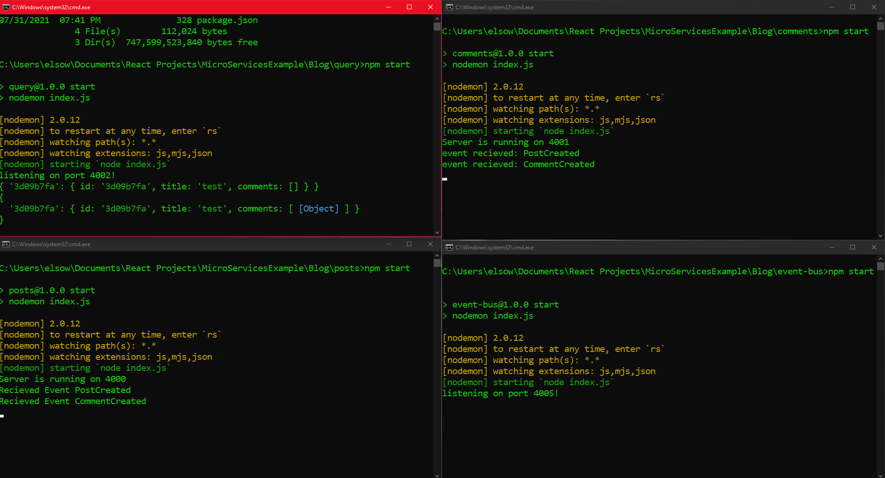
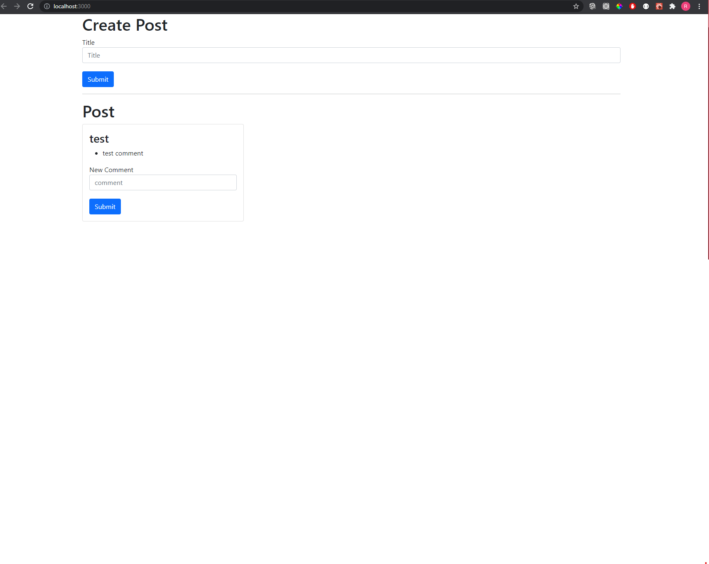

<h1>Microservices Example </h1>

Exploration of using microservices to create scalable sites. This is just a simple mock. A template will be available later with better details.

http://localhost:3000/ == React frontend client.  
http://localhost:4000/ == Node backend Microservice for Posts.  
http://localhost:4001/ == Node backend Microservice for Comments.  
http://localhost:4005/ == Node backend Microservice for Event Bus  
http://localhost:4002/ == Node backend Microservice for Query Service

The application works by emitting events to an event bus that sends the 
type of event, and payload over to listeners that are subscribed. 

In the subscribers of this event and data, is also a query service that handles
merging data and sending/recieving to the front end. 

If a service were to fail, the application will continue working without dependency on another

 
 

